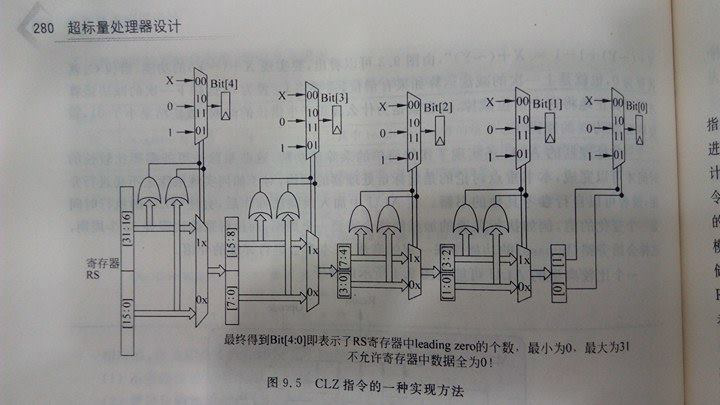

# Bit_Manipulation_RISC_V  

For Bit manipulation analysis, implementation, and documentation within the workgroup.  

Editor: Po-wei Huang  

Instruction list for encoding and reference implementation
==================
*   [CLZ](#clz)
    *   [Status](#status_clz)
    *   [Encoding scheme](#encoding_clz)
    *   [Reference implementation](#ref_clz)
    *   [Analysis](#analysis_clz)
    *   [Todo](#todo_clz)
*   [Reference](#ref)
<h2 id="clz">CLZ</h2>
<h3 id="status_clz">Status_CLZ</h3>
    * Verilog coding: Done, but just for 32 bit now, 64 bit version not finished.   
    * Verification: Not yet.    
    * Evaluation: Done, as long as there is not a bug inside verilog code. Please see the analysis section.  
<h3 id="encoding_clz">Encoding Scheme</h3>
TBD
<h3 id="ref_clz">Reference implementation</h3>  
The reference implementation comes from [1].  
For code in verilog, please refer to CLZ.v.  

 

<h3 id="analysis_clz">Analysis</h3>
From the verilog code and architecture diagram, I'm convinced that it's log(N) for timing.   

For further evaluation, we should use EDA tool to see the critical path for 32 bit and 64bit to verify that it's log(N) in timing.

<h3 id="todo_clz">Todo</h3>
    * Verification not yet.   
    * 64 bit version .  
    * Synthesize to make sure it's log(N).  
    * Considering area effect.  

<h2 id="ref">Reference</h2>
[1]. Superscalar processor design (a chinese book)  
http://www.books.com.tw/products/CN11105742

